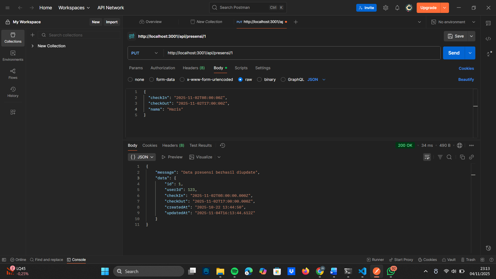

# 📘 Dokumentasi Tugas

1. **Endpoint Update Data Presensi**  
   

2.**Endpoint delete data**
   

3.**Endpoint search berdasarkan tanggal**
   

4. **Endpoint update jika format tanggal yang diisi tidak valid**
   

5. **Enpoint search berdasarkan nama**
   

