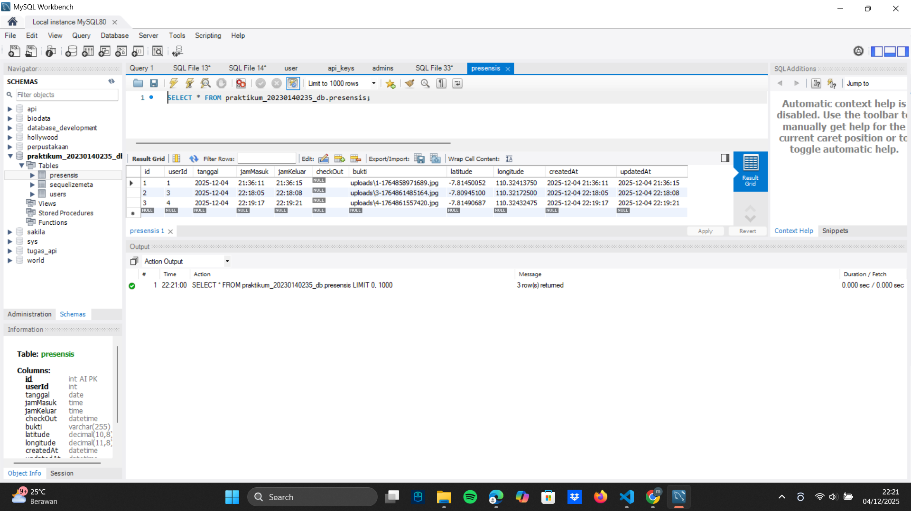
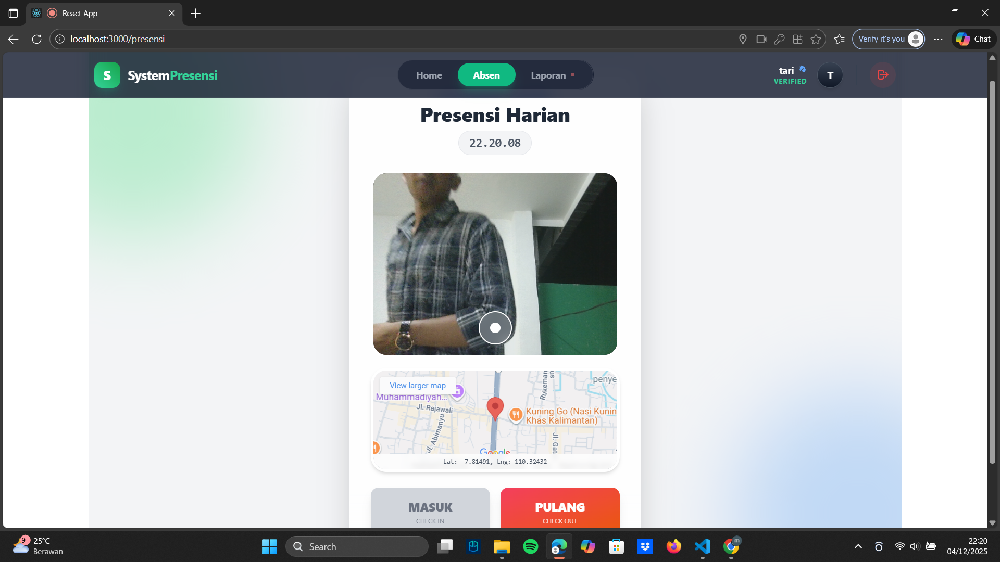
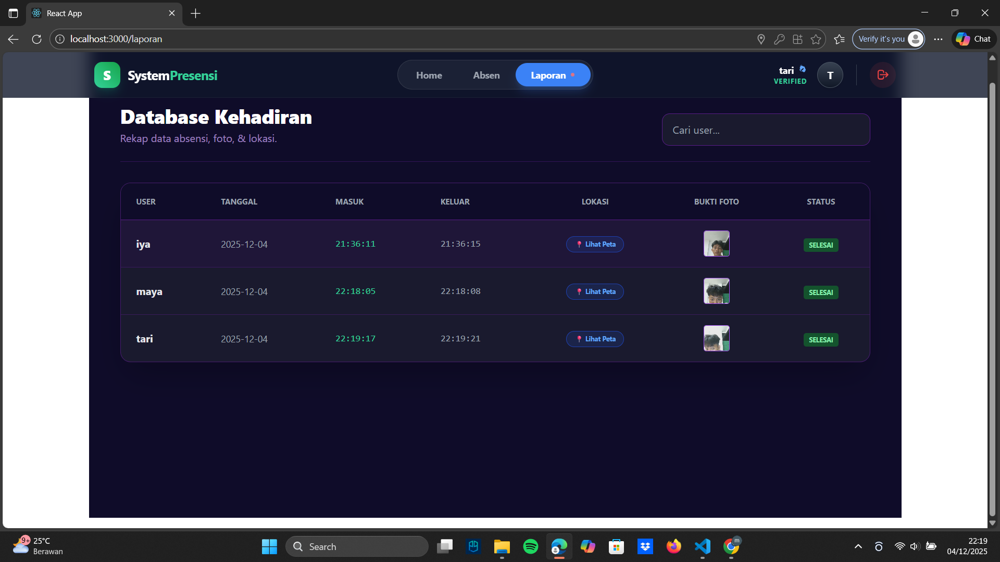
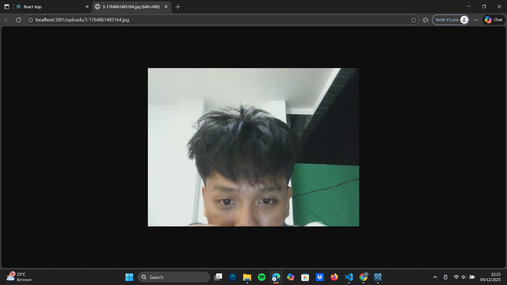

# Laporan Tugas 10: Integrasi Foto & Lokasi

Berikut adalah dokumentasi hasil pengerjaan Tugas 10.

## 1. Konfigurasi Database
Saya telah menambahkan kolom `bukti`, `latitude`, dan `longitude` pada tabel database untuk keperluan penyimpanan foto dan lokasi user.

## 2. Halaman Presensi (Input)
Tampilan halaman presensi dimana user dapat mengambil foto selfie dan mendeteksi lokasi (GPS) sebelum melakukan Check-in.

## 3. Halaman Laporan (Output)
Tampilan halaman laporan admin. Data yang masuk sudah menampilkan:
* Jam Masuk/Keluar
* Link Lokasi (Peta)
* Thumbnail Bukti Foto

## 4. Thumbnail foto

